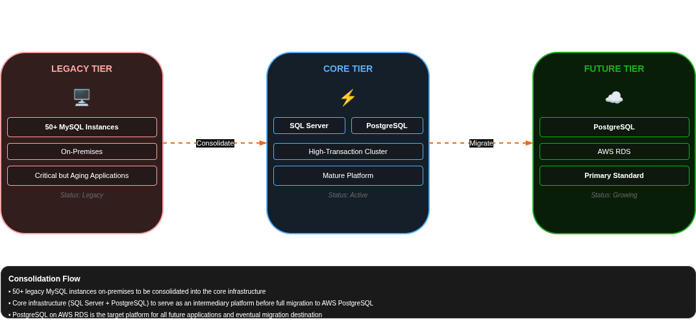
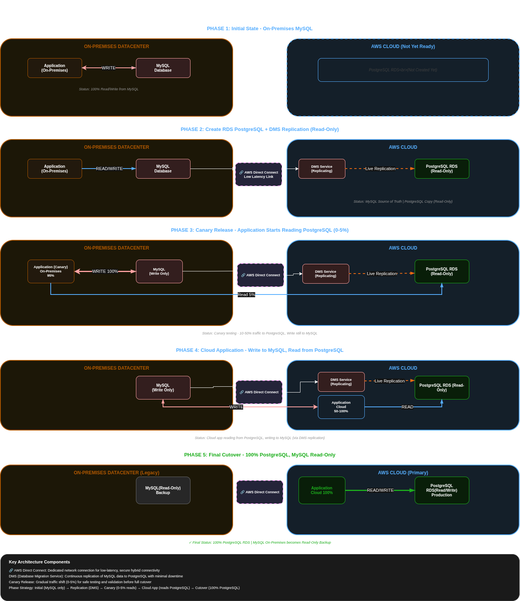

# Technical Proposal

## Introduction

The initial phase of the project is summarized in the following picture:




## Task
Define a a strategy for:

### 1. Migration On-Prem MySQL to PostgreSQL on AWS RDS

#### Schema Evolution - Object Types

In order to migrate the MySQL database to PostgreSQL on AWS RDS, we will follow these steps:

* Choose a a tool can help use to migrate all the database objects (types, triggers, procedures, functions, views, etc.) from MySQL to PostgreSQL.

Based on my research, some the tools availables are:

| Tool                                 | Pros                                                                                                                                                                                                                       | Cons                                                                                                                                                                                        | Best Use Case                                                                                                   |
|--------------------------------------|----------------------------------------------------------------------------------------------------------------------------------------------------------------------------------------------------------------------------|---------------------------------------------------------------------------------------------------------------------------------------------------------------------------------------------|-----------------------------------------------------------------------------------------------------------------|
| **Ora2Pg**                           | - Open source and free<br>- Strong PostgreSQL-focused migration capabilities<br>- Generates assessment reports and migration estimates<br>- Exports schema, data, functions, triggers, procedures<br>- Highly customizable | - CLI-based, steep learning curve<br>- Requires strong PostgreSQL expertise<br>- Less automation than commercial tools<br>- Limited GUI for stakeholders                                    | Best for PostgreSQL-centric teams who want a powerful open-source migration toolkit and have in-house expertise |
| **pgloader**                         | - Open source and free<br>- Very fast data loading<br>- Direct MySQL → PostgreSQL migration<br>- Auto-handles many datatype conversions<br>- Simple setup                                                                  | - Limited schema assessment/reporting<br>- Weak support for procedures, triggers, complex logic<br>- Minimal migration governance features<br>- Not ideal for enterprise-scale analysis     | Best for small/medium migrations, PoCs, or fast data movement with simple schemas                               |
| **EDB Migration Portal**             | - Web-based UI<br>- Automated schema assessment and conversion<br>- PostgreSQL-focused tooling<br>- Migration reporting and analysis<br>- Vendor-backed support                                                            | - Commercial product (licensing cost)<br>- Less flexible than open-source tools<br>- Stronger value when tied to EDB ecosystem<br>- Still requires manual fixes for complex logic           | Best for enterprise PostgreSQL migrations with need for vendor support and guided workflows                     |
| **AWS SCT (Schema Conversion Tool)** | - Free AWS tool<br>- Tight integration with AWS DMS + RDS<br>- Good assessment reports and effort estimation<br>- Supports heterogeneous migrations (MySQL, SQL Server, etc.)<br>- Widely used in AWS migrations           | - Limited conversion for complex SQL (procedures, triggers)<br>- Requires manual refactoring of incompatible objects<br>- Desktop-based tool<br>- AWS-centric (cloud lock-in consideration) | Best for AWS-based migrations, especially when paired with AWS DMS for near-zero downtime migration             |

As we can see in the introduction, our future database will be on AWS RDS, so we will choose AWS SCT as our migration tool, since it is a tool provided by AWS and it is compatible with AWS RDS.

Unfortunately, AWS SCT does not support the migration of procedures, triggers, functions, etc. so we will have to migrate them manually. We will have to analyze each object and rewrite it in PostgreSQL syntax. Deep testing will be required to ensure that the migrated objects work correctly in PostgreSQL and performance is not affected.


#### Schema Evolution - Data Integrity

Special attention will be given to data integrity during the migration process. Depending the SQL_MODE settings in MySQL some data may be need to be modified in order to be compatible with PostgreSQL. For example, if the SQL_MODE is set to allow invalid dates, we will have to clean the data before migrating it to PostgreSQL, since PostgreSQL does not allow invalid dates. (Zero Dates)

We also might need to change objects names since MySQL allows to have duplicate index names in different tables. On Postgres this is not allowed, so we will have to rename the indexes in order to avoid conflicts.


#### Schema Evolution - App Pipeline

Because app it might be already using  on-pre MySQL, changes in the pipeline will be required to make it compatible with PostgreSQL. We will have to analyze the app code and identify all the places where the database is being accessed. Then, we will have to modify the code to use PostgreSQL syntax and connection parameters. Deep testing will be required to ensure that the app works correctly with PostgreSQL and performance is not affected.


E.G. If app pipeline creates news indexes for "old" tables, the syntax needs to be adapted for avoind any impact.
```
CREATE INDEX CONCURRENTLY
```

#### Schema Evolution - Locking Behaviour

1. Row Locking
MySQL locks index records and in the worst case scenario if there is no index to ouse it may block the whole table. On PostgreSQL, row locking is used, so only the rows that are being modified will be locked, allowing for better concurrency and performance. (Tick)

Action Item: As PostgreSQL plays better in this way we shouldn't check actively nothing

2. Gap Locking
When a select between 2 values of a indexed column is performed,  if any other transaction tries to insert a value within the range, it will be blocked until the first transaction is committed. On PostgreSQL this is handle differently since is blocking phisically the records and it allows inserts between the gap.

Action Item: As before, PostgreSQL handles this better than MySQL, so we shouldn't check actively nothing

3. Schema Changes (DDL)
Both MySQL and PostgreSQL lock the table when a DDL statement is executed.

Action Item: For altering big tables, highly access using third party tools like pt-online-schema-change or gh-ost should be used to avoid downtime. For small tables, we can use the standard ALTER TABLE statement, but we should schedule it during low traffic periods to minimize the impact on users.


#### Zero Downtime Migration

Regarding the data migration itself, as far as I know there is no possibility of using native replication between MySQL and PostgresSQL because the log format between them are different.

MySQL - Uses binary log format
PostgreSQL - Uses Write-Ahead Logging (WAL)

However, we can achieve near-zero downtime migration using AWS DMS (Database Migration Service) in combination with AWS SCT. The process would be as follows:
1. Use AWS SCT to assess the MySQL database and generate the PostgreSQL schema.
2. Use AWS DMS to set up a replication task that continuously replicates data from MySQL to PostgreSQL. This allows us to keep the data in sync while we perform the migration.
3. Once the data is fully replicated  we can start asking application team to test the application against the new PostgreSQL database. This will allow us to identify any issues or performance bottlenecks before the final cutover.

There is another option I have been tracking recently a part of DMS that we can use as an alternative of DMS.

https://pgchameleon.org/

Looks like both DMS and pgchameleon are good options for achieving near-zero downtime migration, but DMS is a fully managed service provided by AWS, which means it can be easier to set up and manage, especially if we are already using AWS services. On the other hand, pgchameleon is an open-source tool that can be more flexible and customizable, but it may require more manual setup and maintenance.

#### Hybrid Connectivity

1. Phase 1: Initial State
**Baseline Configuration**
- On-premises application fully reads and writes to MySQL database
- AWS cloud infrastructure not yet deployed
- Direct Connect connection ready for future hybrid connectivity
- No active replication or cloud resources

2.  Phase 2: PostgreSQL RDS Deployment with AWS DMS
**Preparation Phase**
- Deploy PostgreSQL database on AWS RDS
- Execute AWS Schema Conversion Tool (SCT) for automated schema migration
- Configure AWS Database Migration Service (DMS) for continuous replication
- **Key Point:** PostgreSQL RDS operates in read-only mode during this phase
- MySQL on-premises remains the system of record for all transactions
- Real traffic continues flowing to MySQL; PostgreSQL receives replicated data only

3. Phase 3: Canary Release - On-Premises Read Shift
**Gradual Traffic Validation**
- On-premises application gradually shifts read operations to PostgreSQL RDS (via Direct Connect)
- Implement canary release strategy: initially 0-5% of read traffic routes to PostgreSQL
- Application continues writing 100% to MySQL on-premises
- Validates application compatibility and PostgreSQL performance under production load
- MySQL remains the primary write target

4. Phase 4: Cloud Application Deployment
**Hybrid Write Pattern**
- Deploy new cloud-based application in AWS
- Cloud application reads from PostgreSQL RDS
- Cloud application writes back to on-premises MySQL (via AWS Direct Connect)
- Both on-premises and cloud applications operate simultaneously
- Ensures data consistency across environments

5. Phase 5: Final Cutover
**Complete Migration**
- Scale on-premises canary release to 100% traffic on PostgreSQL
- Disable read-only mode on PostgreSQL RDS - now accepts write operations
- Transition MySQL on-premises to read-only mode (serves as backup)
- All application traffic (read and write) routes to PostgreSQL RDS
- On-premises MySQL becomes secondary read replica for disaster recovery

Key considerations:
* All trffi is routed through Direct Connect to ensure low latency and secure connectivity between on-premises and AWS environments.
* A new application logic flow will be needed in order to use PostgreSQL connectivty
* In case of DMS job stop, fast rollkback of canay releaase will be needed in order to stop reading stale reads
* Canary release can be increased gradually to minimize risk and allow for performance monitoring and issue resolution before full cutover. (From 5% to 100% in increments of 10-20% every few days/weeks, depending on the stability and performance observed)
* In the last phase a brief downtime will be needed when switching from MySQL (write) to PostgreSQL (write). This downtime can be minimized by performing the cutover during low traffic periods and by ensuring that all data is fully replicated to PostgreSQL before the final switch.

