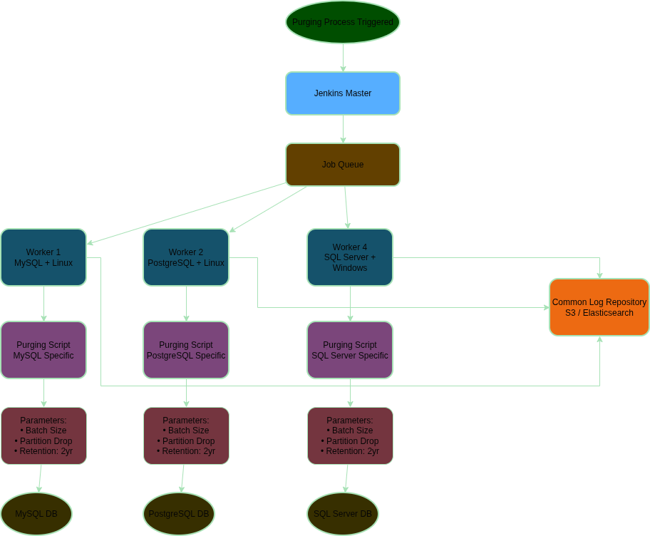

# Technical Proposal

## Automation, Security & Governance

### Infrastructure as Code (IaC)

My approach will be to have Git Report with all Ansible playbooks.

For Database provisioning we should have:

* Common roles that are applied in all environments (dev, staging, prod) with the common configuration for all databases. This will ensure consistency across environments and reduce the risk of misconfiguration. E.G (OS tuning, authtication, monitoring agents, etc)
* Specific roles for each database flavour (MySQL, PostgreSQL, etc) with the specific configuration for each database. E.G (MySQL: innodb settings, PostgreSQL: max_wal_size, etc)
* All specific configuration specific for each deployment/environment should be parametrized and stored in a separate file (e.g. group_vars) to allow for easy management and updates.
* All playbooks should be idempotent to ensure that they can be run multiple times without causing any issues or inconsistencies in the configuration.

A commong Ansible playbook structure could be:

```
playbooks/
├── common/
│   ├── tasks/
│   │   ├── main.yml
│   │   ├── os_tuning.yml
│   │   ├── monitoring.yml
│   │   └── security.yml
│   └── handlers/
│       └── main.yml
├── mysql/
│   ├── tasks/
│   │   ├── main.yml
│   │   ├── innodb.yml
│   │   └── replication.yml
│   └── handlers/
│       └── main.yml
├── postgresql/
│   ├── tasks/
│   │   ├── main.yml
│   │   ├── max_wal_size.yml
│   │   └── partitioning.yml
│   └── handlers/
│       └── main.yml
└── group_vars/
    ├── dev.yml
    ├── staging.yml
    └── prod.yml
```

An example of a playbook to provision a PostgreSQL database could be:

```
- name: Provision PostgreSQL Database
  hosts: postgresql_servers
  become: yes
  roles:
    - common
    - postgresql
```

An example of specifying some group variables for the PostgreSQL database could be:

```postgresql_servers:
  max_wal_size: 1GB
  synchronous_commit: off
  partitioning: true
```

Regarding teh term of Golden Images I prefer to apply Ansible playbook often in order to ensure all deployments have latest configuration and security patches. My idea would be always to start with Vanilla image of our OS (it could be Rocky Linux, Ubuntu, etc) and then apply Ansible playbook to configure the database.

Then, we can define a process to run the ansible playbooks in a regular basis (e.g. weekly, bi-weekly, etc) to ensure that all databases are up to date with the latest configuration and security patches. This process can be automated using a CI/CD pipeline (e.g. Jenkins, GitLab CI, etc) that runs the playbooks on a schedule or triggered by changes in the playbooks or group variables.


### Data Purging Atuomation

The key point here is we are managing different RDBMS with different OS.

My design would be to have a Jenkins platform with different workers for each RDBMS/OS combination. Each worker would have the necessary tools and libraries to connect to the specific RDBMS and execute the purging scripts.

Then basically the process would connect to RDBMS/OS combination and it would execute the purging script. The purging script would be parametrized to allow for different purging strategies (e.g. delete in batches, drop partitions, history to deleted (default 2 years), etc)

Each worker would be responsible for executing the script and reporting the results back to Jenkins. Furthermore, after the purgin execution we must upload all logs generate to a common repository (e.g. S3, Elasticsearch, etc) to allow for monitoring and troubleshooting.



### Security Awareness

This ultimetely to be a bad practice. As Database administrator we are responsible to ensure the security of our databases and the data they contain. If a new admin is created for that database we are not sure what the developer can execute, and in the worst case he can create other admin users for future use. Here we are breaking the chain control and we are opening a security hole in our database.

I think if developer needs to fix a bug he needs to create a new application release where a SQL file will be executed as part of the release. This SQL file will contain the necessary SQL commands to fix the bug. This way we can ensure that all changes to the database are controlled and auditable.

Nowadays exists some good libraries than help us to control database migrations on the application side (Good, Liquibase, etc)

In any case, if my manager asked me to do this because we dont't have any other alternative, I would create a pipeline that create the requests user with least privileges possible. This user will be deleted automatically after X amount of time by another pipeline that is constantly running and checking for any user that has been created more than X amount of time. This way we can minimize the security risk of having a user with elevated privileges for a long period of time.